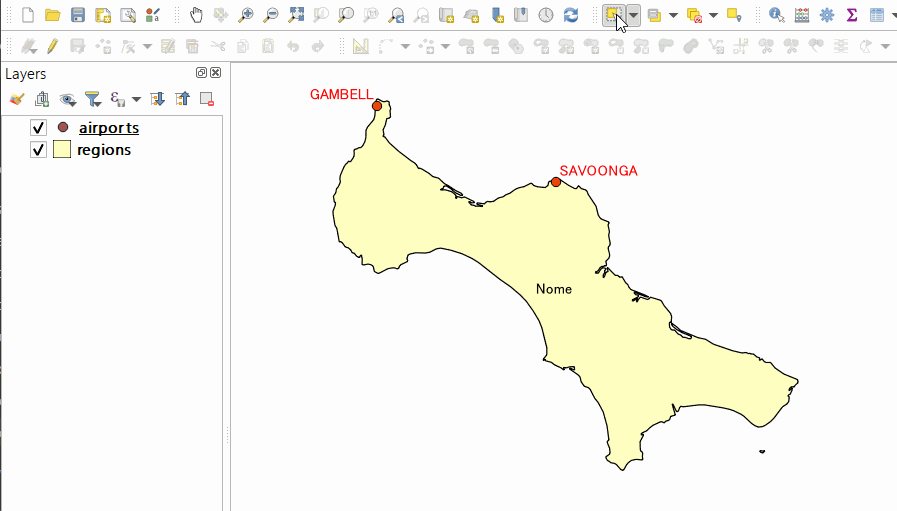

# Operate Multiple Layers

This QGIS plugin watches the operation of some tools and applies them to other selected layers. In order to work, features on the current layer must be selected. Currently supported tools are "Move Feature", "Rotate Feature", "Scale Feature" and "Delete Selected". "Select Features by Area (rectangular selection only)" and "Undo / Redo" will also supports multiple layers.

